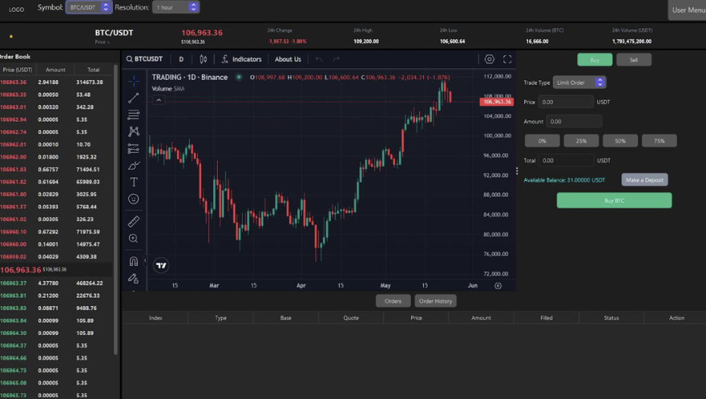
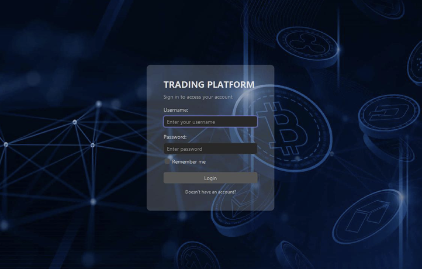
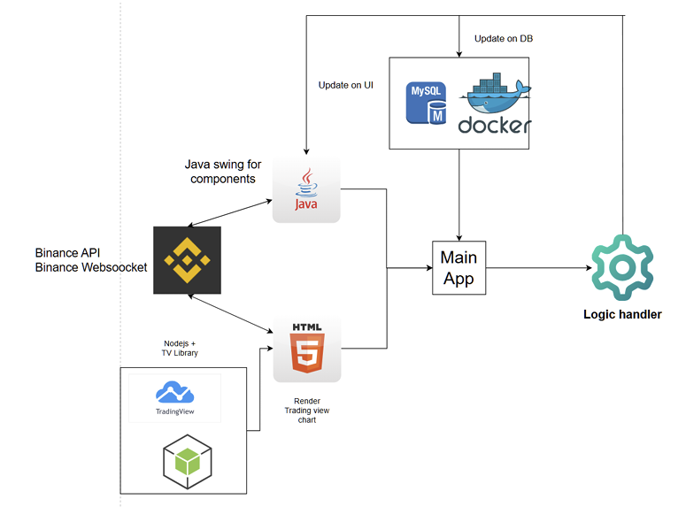
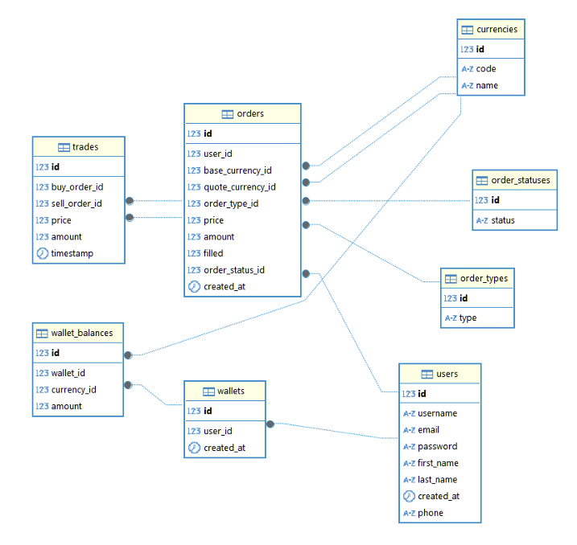

# 🌊 OceanGate - FullStack Cryptocurrency Trading Platform

**OceanGate** is a desktop cryptocurrency trading platform built with **Java Swing**, **FlatLaf**, **JCEF (Java Chromium Embedded Framework)**, **TradingView Charts**, and **MySQL**. It features real-time cryptocurrency data streaming from the Binance API & WebSockets, live order book updates, an integrated order matching engine, multi-currency wallet management, and an interactive TradingView chart interface.

---

## 📸 Screenshots & Visual Overview

### 🖥️ Main Look (Trading Dashboard)
The primary trading interface features real-time price tickers, an active order book, an embedded TradingView candlestick chart, limit order placement controls, and user order history.



---

### 🔑 Login Screen
Clean and intuitive authentication dialog for user login and account creation with custom crypto dark theme graphics.



---

## 🏗️ System Architecture

The application follows a decoupled desktop-web hybrid architecture:
- **Java Swing UI**: Powers the core application container, live order book, order entry panels, and user settings using FlatLaf and MigLayout.
- **Embedded Web Engine (JCEF)**: Hosts a Node.js / Next.js container rendering the interactive TradingView financial charting library.
- **Binance WebSocket / API Integrations**: Streams real-time ticker prices, order book depth, and market statistics directly into the UI.
- **Backend & Database**: Java logic handlers interact with a containerized MySQL database managed via Docker to persist users, wallets, order history, and executed trades.



---

## 🗄️ Database Architecture (ERD)

The relational database is containerized with MySQL and manages user credentials, wallet balances, trading pairs/currencies, order types, order statuses, orders, and executed trades.



### Key Database Tables:
- **`users`**: Stores user registration data, credentials, and contact information.
- **`wallets` & `wallet_balances`**: Manages user wallet instances and balance allocations per currency (e.g., BTC, ETH, USDT).
- **`currencies`**: Defines supported crypto/fiat assets.
- **`order_types` & `order_statuses`**: Reference tables for order classification (BUY/SELL) and execution status (OPEN, PARTIALLY_FILLED, CLOSED).
- **`orders`**: Tracks active and historical limit orders with target price, amount, and filled volume.
- **`trades`**: Records matched executions connecting buyer and seller order IDs.

---

## ✨ Key Features

- 📈 **Real-Time Data Streaming**: Connects directly to Binance WebSockets for ticker and order book updates.
- 📊 **Interactive TradingView Charts**: Full candlestick charting functionality with custom timeframe resolutions (1h, 1D, etc.) and technical indicators.
- ⚡ **Order Matching Engine**: Internal trade engine to place limit orders, match bids/asks, and automatically settle wallet balances.
- 👛 **Wallet & Balance Management**: Track multi-currency balances, available funds, deposit simulation, and total asset allocation.
- 🔐 **User Authentication & Profiles**: Secure sign-in, user registration, account setting management, and profile customization.
- 🎨 **Modern Dark UI**: Designed with FlatLaf, custom Binance PLEX typography, dynamic layout handling via MigLayout, and dark aesthetic styling.

---

## 🛠️ Technology Stack

| Layer | Technology / Library |
| :--- | :--- |
| **GUI Framework** | Java Swing, FlatLaf (3.6), MigLayout (11.4.2) |
| **Embedded Web Browser** | JCEF (Java Chromium Embedded Framework v132) |
| **Charting Library** | TradingView Lightweight Charts / Next.js / Node.js |
| **Market Data Stream** | Binance REST API & Binance WebSockets |
| **Programming Language** | Java 21 |
| **Build & Dependency Tool** | Apache Maven |
| **Database Management** | MySQL 9.1 (Docker Containerized) |
| **JSON Serialization** | Gson |

---

## 🚀 Getting Started & Installation

### 📋 Prerequisites

Ensure you have the following installed on your system:
- **JDK 21** or later
- **Apache Maven 3.8+**
- **Docker & Docker Compose** (or Docker Desktop)
- **Node.js (v18+) & npm** (for the TradingView chart service)

---

### 1️⃣ Database Setup

1. Start the MySQL database container:
   ```bash
   docker compose -f db-docker.yaml up -d
   ```

2. Initialize the database schema and sample data using `db.sql`:
   ```bash
   docker exec -i xampp_mysql mysql -u uitjava@1 -psunh@12 master < db.sql
   ```

---

### 2️⃣ TradingView Chart Service Setup

1. Navigate to the `TVChart` directory:
   ```bash
   cd TVChart
   ```

2. Install Node dependencies and start the chart server:
   ```bash
   npm install
   npm run dev
   ```

---

### 3️⃣ Run the Desktop Application

1. Open a new terminal in the project root directory.
2. Compile and run the Java Swing application using Maven:
   ```bash
   mvn clean install
   mvn exec:java -Dexec.mainClass="app.MainApp"
   ```
   *Or launch `src/main/java/app/MainApp.java` directly from your IDE (IntelliJ IDEA / Eclipse).*

---

## 📁 Repository Structure

```
OceanGate-FullStack/
├── assets/                  # Screenshot & architecture diagram assets
│   ├── architecture.png
│   ├── db_architecture.png
│   ├── login_screen.png
│   └── main_look.png
├── TVChart/                 # Next.js / Node.js TradingView web component
├── db-docker.yaml           # Docker compose configuration for MySQL
├── db.sql                   # Database table schemas and seed data
├── pom.xml                  # Maven configuration & Java dependencies
├── Binance_PLEX.ttf         # Custom typography font asset
└── src/
    └── main/
        ├── java/
        │   ├── app/         # Application entry point (MainApp)
        │   ├── chart/       # JCEF web browser chart integration
        │   ├── controller/  # UI & Business controllers
        │   ├── dataAccess/  # DAOs & Database layer
        │   ├── login/       # Auth dialog & signup UI
        │   ├── models/      # Data models (Order, User, Trade, Wallet)
        │   ├── services/    # Order matching, DB manager, Binance streaming
        │   ├── ui/          # Swing components (Top, Left, Center panels)
        │   ├── user_menu/   # User profile & account setting panels
        │   └── utils/       # Helpers, constants, conversions
        └── test/            # Unit tests (Order Matching, etc.)
```

---

## 📜 License

This project is created for educational and development purposes.
